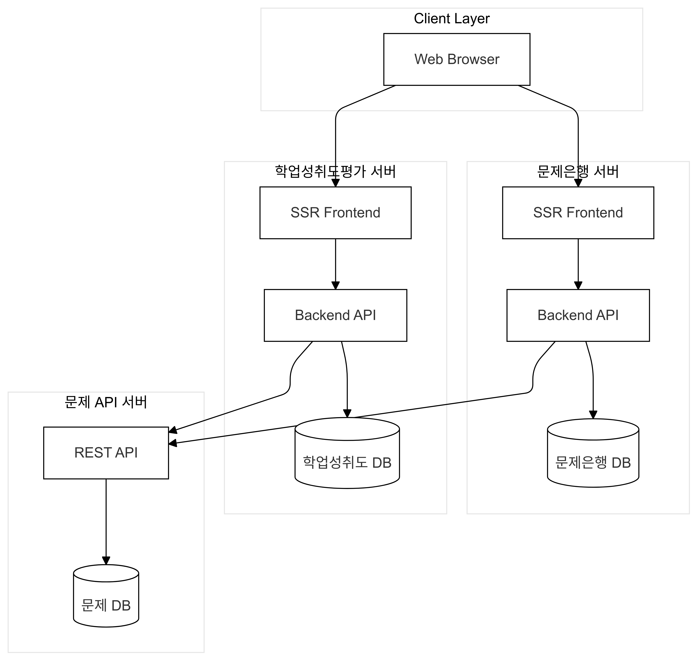
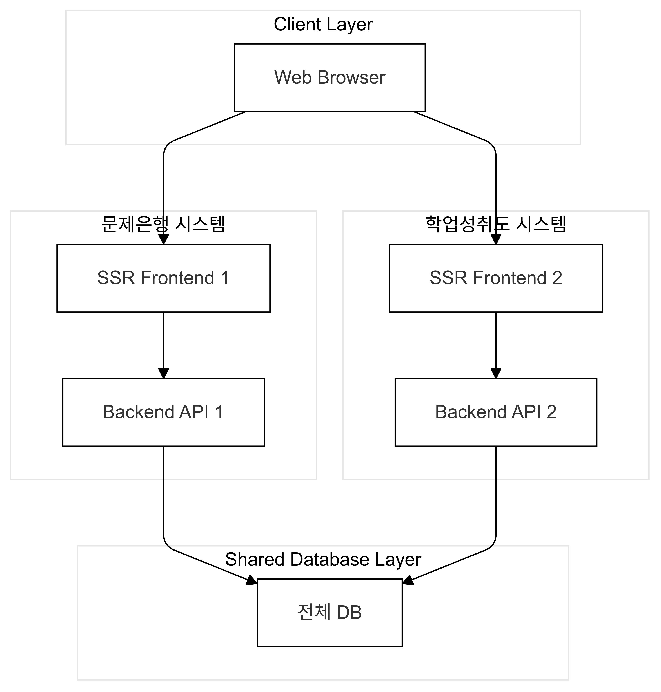
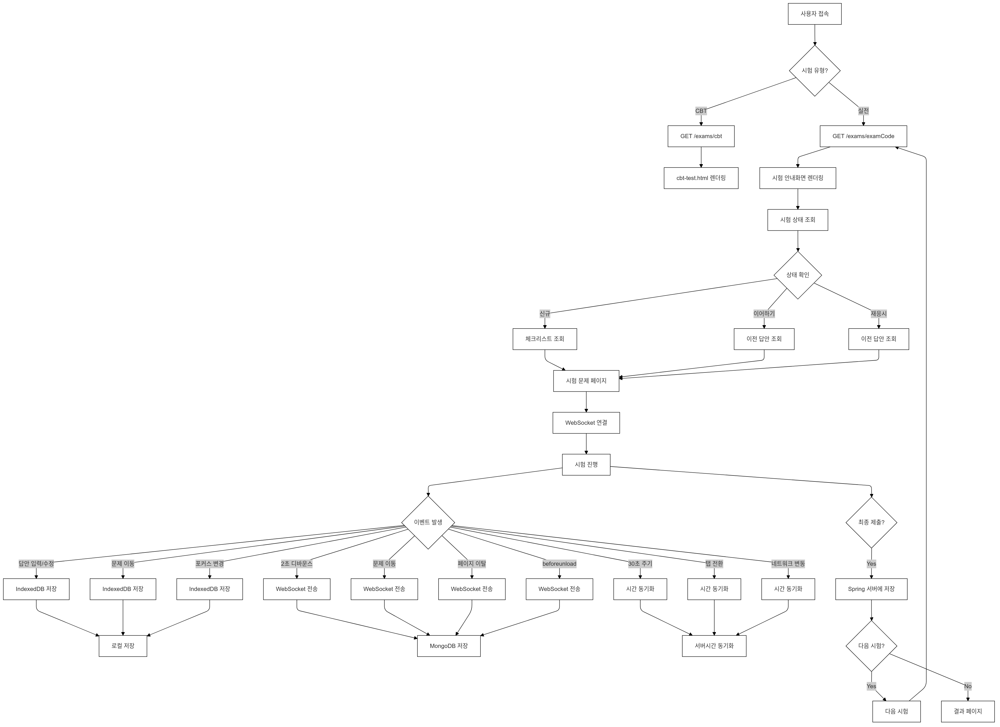

## 시험 시간 실시간동기화 및 자동저장에 대한 옵션

1. Ajax Polling
    - 장점 : 
        - 구현 간단
        - 브라우저 호환성 우수
        - 방화벽 문제 X
    - 단점 :
        - 비효율적인 트래픽 사용 (서버부하 큼)
        - 불필요한 요청 발생
        - 실시간성 부족
    - 적합한 상황 :
        - 소규모 시스템
        - 레거시 브라우저 지원 필요
        - 간단한 구현 필요시

2. WebSocket
    - 장점 :
        - 양방향 실시간 통신
        - 효율적인 리소스 사용
        - 낮은 지연시간
    - 단점 : 
        - 구현 복잡
        - 연결 관리 필요
        - 일부 환경에서 재한될 수 있음
    - 적합한 상황 :
        - 실시간성이 중요할 때
        - 많은 데이터 교환이 필요할때
        - 양방향 통신이 필요할때

3. Window Event Listener
    - 장점 :
        - 구현 매우간단
        - 서버 부하 최소화
        - 리소스 효율적
    - 단점 :
        - 브라우저 강제 종료시 동작 안함
        - 실시간성 없음
        - 신뢰성 낮음
    - 적합한 상황 :
        - 보조적인 저장 방식으로 사용
        - 리소스 제약이 심한 환경
        - 단순한 백업 용도
4. gRPC
    - 장점 :
        - 매우 높은 성능
        - 강력한 타입 안정성
        - 효율적인 프로토콜
    - 단점 :
        - 브라우저 직접 지원 안됨
        - 구현 복잡
        - 인프라 설정 필요
    - 적합한 상황 :
        - 매우 높은 성능이 필요할때
        - 대규모 시스템
        - MSA
    
5. SSE (Server-Sent Events)
    - 장점:
        - 서버에서 클라이언트로의 효율적인 푸시
        - 자동 재연결
        - HTTP 기반으로 호환성 좋음
    - 단점:
        - 단방향 통신만 가능
        - IE 지원 안됨
        - 연결수 제한될 수 있음
    - 적합한 상황:
        - 서버에서 클라이언트로의 알림이 주요할 때
        - 실시간 업데이트가 필요할 때

6. 하이브리드 방식 (WebSocket + IndexDB + Window Event)
    - 장점:
        - 높은 신뢰성
        - 오프라인 지원
        - 다중 백업
    - 단점:
        - 구현 복잡
        - 리소스 사용량 높음
        - 동기화 로직 복잡
    - 적합한 상황:
        - 높은 신뢰성이 필요할 때
        - 오프라인 지원이 필요할 때
        - 리소스 제약이 적을 때

7. Long Polling
    - 장점:
        - 실시간에 가까운 응답
        - 방화벽 문제 없음
        - 구현 비교적 간단
    - 단점:
        - 서버 리소스 사용량 높음
        - 스케일링 어려움
        - 지연시간 있음
    - 적합한 상황:
        - WebSocket 사용이 어려운 환경
        - 중간 규모의 시스템
### 결론 1
[Client Browser]
         ↓
[Nginx Load Balancer] (SSL/TLS 처리, 정적 파일 서빙, 리버스 프록시)
    ↙️                 ↘️
[Node.js Cluster]   [Spring Boot Cluster]
(WebSocket Server)   (REST API Server, Frontend Rendering, Business Logic)
    ↓                   ↓
[MongoDB]           [MySQL]
(임시 저장)            (영구 저장)

### 결론 2
1. **메인 서버 (Spring Boot)**
    - 회원 관리, 인증/인가
    - 시험 문제 관리
    - 최종 제출 및 채점 처리
    - 결과 분석 및 통계

2. **실시간 서버 (Node.js)**
    - WebSocket을 통한 시험 시간 동기화
    - 임시 저장 처리
    - 클라이언트 상태 관리

3. **구체적인 동작 방식**
[클라이언트]
- IndexedDB: 로컬 임시 저장소
- WebSocket: 서버와 실시간 통신
- Window Event: 브라우저 종료 감지

[실시간 서버]
- MongoDB: 임시 저장소
- WebSocket Server: 실시간 통신 처리
- 주기적으로 메인 서버와 동기화

[메인 서버]
- MySQL: 영구 데이터 저장
- REST API: 시험 관련 주요 기능 처리

4. **저장 프로세스**
    1. 사용자 답안 입력
    2. IndexedDB에 즉시 저장
    3. WebSocket으로 Node.js 서버에 전송
    4. MongoDB에 임시 저장
    5. 주기적으로 Spring Boot 서버에 동기화 (필요한지 고민해볼것)
        - 시험 현재 상태만 저장하면 될거같음
    - 추가 정보
        1. 즉시저장 (IndexedDB)
            - 답안 입력/수정할 때마다
            - 문제 이동시
            - 포커스 변경시
        2. WebSocket 전송 (Node.js + MongoDB)
            - 답안 변경 후 일정 시간 경과시 (디바운싱 2초)
            - 문제 이동시
            - 페이지 벗어날때
            - window beforeunload 이벤트 발생시
        3. 스프링 부트 서버 동기화
            - 최종 제출시에만 진행
            - 시험 현재상태만 저장

## 전체적인 시스템 구성

### 문제점 
- 문제은행과 학업성취도평가 서버의 통합분리 이슈
    - 서로 같은 내용을 공유하는곳은 시험문제 뿐이다.
    - 문제은행 서버는 문제 데이터를 저장해야함.
    - 학업성취도평가 서버는 문제 데이터를 조회하여 사용및 결과 저장을 해야함.

### 해결방안
1. 3개의 서버를 두고 각각 다른 역할을 하도록 구성
    - 문제은행 서버 : 문제은행 회원 정보및 전용 데이터 저장 및 프론트 렌더링
    - 학업성취도평가 서버 : 학업성취도 회원및 평가 결과 저장 및 프론트 렌더링
    - 문제 서버 : 문제 데이터 조회 및 저장 (API 서버)
    - 문제은행 서버와 학업성취도평가 서버는 문제 데이터를 공유해야함.

2. 각자 2개의 서버를두고 DB만 공유하는 방식
    - 문제은행 서버와 학업성취도평가 서버는 문제 데이터를 공유해야함.
    - 문제 서버는 문제 데이터를 저장하고 조회하는 역할을 함.

## 노트
1. 로그인
    - 교재 구입인증을 회원가입 로그인으로 대체 가능?
2. 시험 (프론트 / 백)
    - 제출 후 어떻게 해야할지
    - 서술형 체점?
3. 시험결과 분석 (프론트 / 백)
4. 관리자 파트
    - 시험문제 추가수정삭제 가능?
    - 응시자 관리만하면 되는지? (이메일로 대체 가능?)
    - 응시코드부분 기획 미비

### 역할 분배
- 관리자, 로그인 ( 1명 ) (최사랑,한덕용/이원희)
- 시험 문제 풀기 ( 2명 ) (최사랑/강경민)
- 시험 결과 분석 ( 2명 ) (한덕용/조수진)

### 검토 필요 사항
1. 회원 관리 관련
    - 교재 구입 인증 절차를 일반 회원가입으로 대체하는 것이 가능할지 검토 부탁드립니다.
2. 시험 진행 관련
    - 서술형 문항의 채점 방식에 대한 명확한 기준이 필요합니다. (주관식과 객관식만 존재하는 것 인지 궁금합니다.)
    - 시험 진행 시 33, 34페이지의 체크리스트가 모든 케이스(재응시, 응시, 이어하기)에 적용되어야 하는지 확인 부탁드립니다.
3. 시험 상태 관련
    - '이어하기'와 '재응시'의 구체적인 조건 설정이 필요합니다.
4. 관리자 기능 관련
    - 시험 문제의 CRUD 권한 범위를 명확히 해주시면 감사하겠습니다.
        - 만약 문제의 추가, 수정, 삭제가 가능하다면 학업성취도평가 서버에서 문제 데이터를 저장하는 것이 맞는지 확인 부탁드립니다.
    - 응시자 관리 방식(이메일 사용 여부)에 대한 확인이 필요합니다.
    - 응시 코드 발급 및 관리에 대한 상세 기획이 필요합니다.
위 사항들에 대해 검토해 주시면 감사하겠습니다.

### 기능 명세서 1안

***

### 시험 자동저장및 응시 프로세스 구조 1안
1. 시험 응시자가 SpringBoot 서버(/)에 접속
2. 만약 CBT 연습 조회(GET /exams/cbt) 요청이 들어오면 문제 테스트페이지(cbt-test.html)를 렌더링
3. 만약 실전시험 정보 조회(GET /first-exams/{examCode}) 요청이 들어오면 시험 안내화면(first-exam.html)을 렌더링 (로그인 후 접속 가능)
4. 시험 안내화면 렌더링시 시험 상태 조회(GET /exams/{examCode}/status) 요청을 통해 시험 상태를 확인
5. Spring 서버에서 시험 상태를 조회하여 응답 (GET /api/exams/{examCode}/status)
6. 시험 상태에 따라 버튼 렌더링 (응시/이어하기/재응시)
7. 응시 버튼 클릭시 체크리스트 조회(GET /exams/{examCode}/checklist)
    - 응시 상태에따라 달라질 수 있음 만약 재응시 또는 이어하기일경우 체크리스트 조회없이 바로 시험 문제 조회(GET /exams/{examCode}/questions)
8. 모든 항목 체크시 시험 문제 조회(GET /exams/{examCode}/questions) 및 시험 문제 페이지(exam-page.html) 렌더링
9. 렌더링시 domloaded 이벤트 발생시 시험재개(GET /exams/{examCode}/resume) 요청을 통해 이전 응시 데이터 노드 서버에서 조회
10. javascript단에서 시험문제 동기화 만약 Node.js의 응답이 Null 일경우 처음부터 문제를 렌더링
11. 시험문제 동기화 프로세스
    - 1. 즉시저장 (IndexedDB)
        * 답안 입력/수정할 때마다
        * 문제 이동시
        * 포커스 변경시
    - 2. WebSocket 전송 (Node.js + MongoDB)
        * 답안 변경 후 일정 시간 경과시 (디바운싱 2초)
        * 문제 이동시
        * 페이지 벗어날때
        * window beforeunload 이벤트 발생시
    - 3. 시간 동기화
        * 30초 주기적 동기화
        * 탭 전환시
        * 네트워크 변동시
13. 최종 제출 (POST /exams/{examCode}/submit)후 적절한 페이지 리다이렉트 및 최종제출시 MongoDB에 저장

### 시험 자동저장및 응시 프로세스 구조 2안

[초기 접속 및 상태 확인]
1. 시험 응시자가 SpringBoot 서버(/)에 접속
2. 분기처리:
    - CBT 연습: GET /exams/cbt → cbt-test.html
    - 실전시험I: GET /first-exams/{examCode} → first-exam.html (로그인 필수) 
    - 실전시험II: GET /second-exams/{examCode} → second-exam.html (로그인 필수)
        - 해당 내용은 시험 코드만 받을수도 있음 시험 코드만 받을 시 GET /exams/{examCode} 로 처리
3. 시험 상태 확인: 해당 요청은 실전시험I,II 모두 동일하게 처리
>DomLoaded 이벤트 발생시 ajax를통해 구현할 것인지, 아니면 페이지 이동시 구현할 것인지 검토 필요
    - 상태 조회: GET /exams/{examCode}/status
    - 버튼 렌더링: 응시/이어하기/재응시

[시험 시작 프로세스]
4. 시험 시작 분기:
>해당 내용도 기획서에 명확히 명시되어 있지 않아 컴토 필요
    - 신규 응시: 체크리스트 조회 (GET /exams/{examCode}/checklist)
    - 재응시/이어하기: 바로 문제 조회 (GET /exams/{examCode}/questions)

[시험 진행 및 동기화]
5. 시험 페이지 초기화:
    - 문제 렌더링: exam-page.html
    - DOMContentLoaded: GET /exams/{examCode}/resume로 이전 데이터 조회
    - WebSocket 연결 및 서버시간 초기 동기화

6. 실시간 저장 프로세스:
   - IndexedDB (즉시저장):
        * 답안 입력/수정시
        * 문제 이동시
        * 포커스 변경시
   
   - WebSocket (Node.js + MongoDB):
        * 답안 변경 디바운싱(2초)
        * 문제 이동시
        * 페이지 이탈시
        * beforeunload 이벤트시

   - 시간 동기화:
        * 30초 주기적 동기화
        * 탭 전환시
        * 네트워크 재연결시

[시험 종료]
7. 최종 제출:
    - POST /exams/{examCode}/submit
    - 다음 시험 확인 및 리다이렉트
    - MongoDB 데이터 MySQL 이관

### 흐름도

